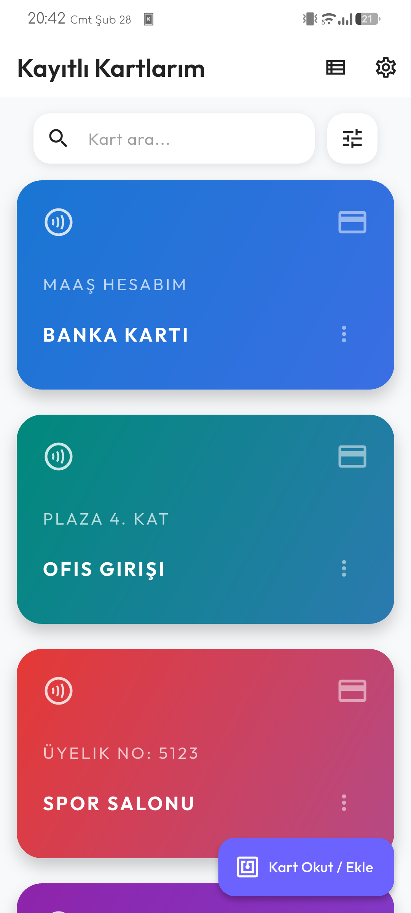
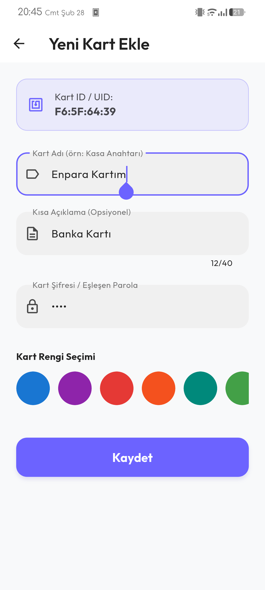
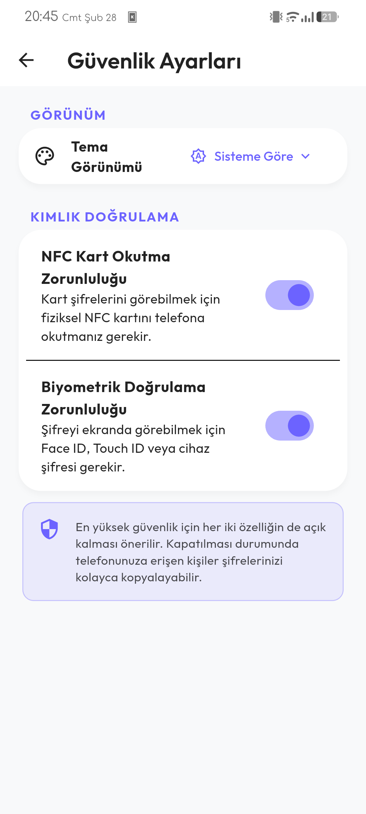
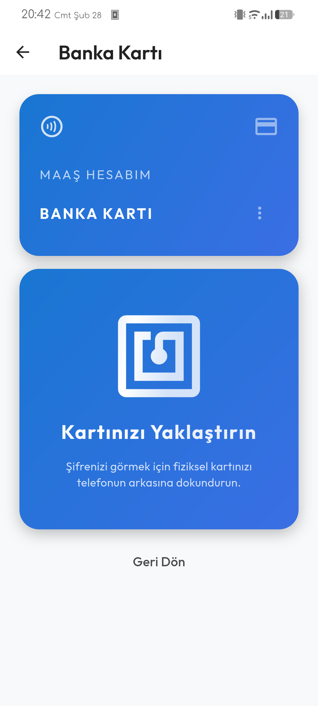
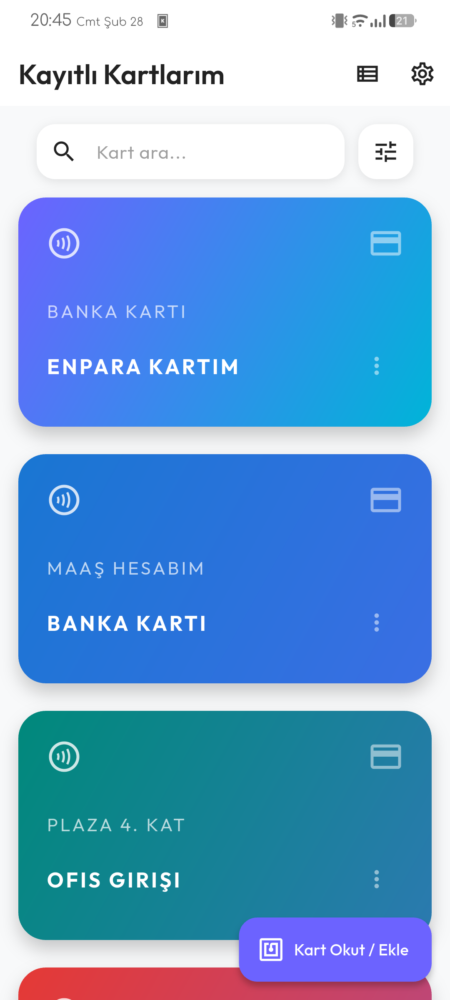
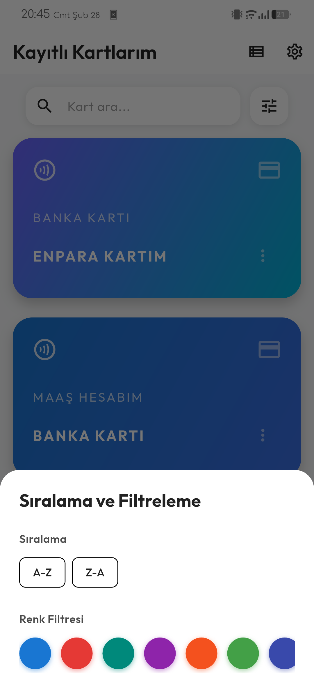
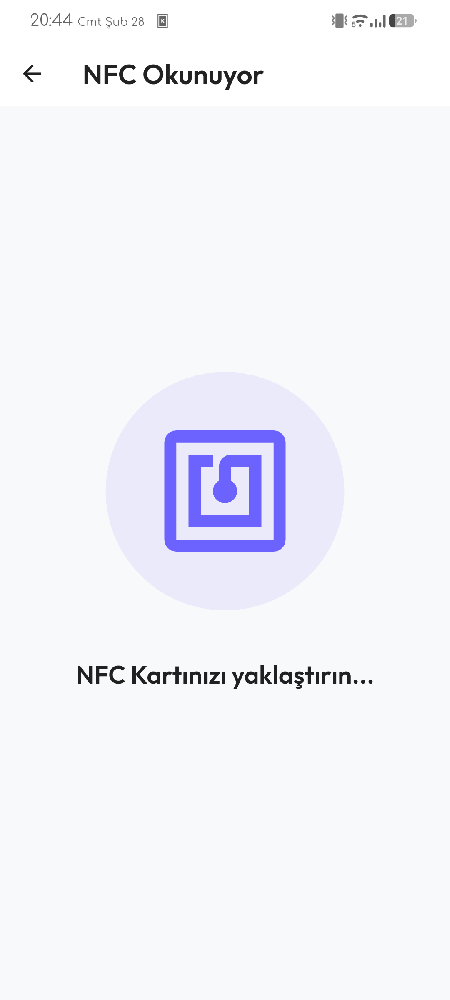
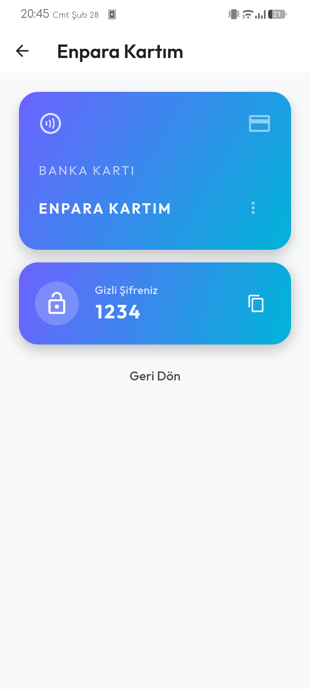
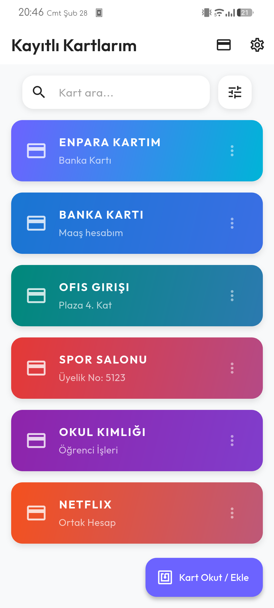

# NFC Card Password Saver 🛡️💳

A modern, secure, and feature-rich Flutter application for storing and managing your credit/debit card details securely on your device. The app ensures maximum privacy and security utilizing robust device-side security mechanisms.

## ✨ Features

- **Secure Storage**: All card details (Cardholder Name, Card Number, Expiry Date, CVV, Password) are encrypted and stored locally using `flutter_secure_storage`.
- **Advanced Authentication**: Protect your stored cards with two layers of security:
  - **Biometric Authentication**: Supports FaceID, TouchID, or device passcode (via `local_auth`).
  - **NFC Key Authentication**: Use an external NFC tag/card as a physical security key to unlock the app (via `nfc_manager`).
- **Modern UI/UX**:
  - Beautiful, dynamic UI with glassmorphism effects and fluid animations.
  - Interactive Shimmer loading effects.
  - Interactive Pull-Down Menus.
  - Custom font integration (Outfit font family).
- **Theme Support**: Includes Light Mode, Dark Mode, and System Default theme support.
- **Offline First**: All data is stored entirely on your device. Completely offline with no data sent to any online servers.

## 📸 Screenshots

| Home & App | View & Auth | Settings & More |
| :---: | :---: | :---: |
|  |  |  |
|  |  |  |
|  |  |  |

## 🛠️ Tech Stack & Packages

- **Framework**: [Flutter](https://flutter.dev/) (SDK ^3.11.0)
- **State Management**: `provider`
- **Security**: 
  - `flutter_secure_storage` (Encrypted local storage)
  - `local_auth` (Biometrics)
  - `nfc_manager` (NFC Tag scanning)
- **Animations/UI**: 
  - `lottie` (Complex high-quality animations)
  - `shimmer` (Loading effects)
  - `pull_down_button` (iOS style pull down menus)
- **Local Data**: `shared_preferences` (App settings)

## 🚀 Getting Started

### Prerequisites
- Flutter SDK installed on your machine (`^3.11.0`).
- An iOS or Android device/emulator (To test NFC and Biometrics efficiently, a physical device is recommended).

### Installation
1. Clone the repository:
```bash
git clone https://github.com/yourusername/nfc_card_password_saver.git
```
2. Navigate to the project directory:
```bash
cd nfc_card_password_saver
```
3. Install dependencies:
```bash
flutter pub get
```
4. Run the app:
```bash
flutter run
```

## 🔒 Security Approach
This application does not rely on a backend server. Instead, it delegates security to your device's built-in cryptographic hardware (Secure Enclave / Keystore), guaranteeing zero-knowledge offline storage.

## 🤝 Contributing
Contributions, issues, and feature requests are welcome! Feel free to check the issues page.

## 📄 License
This project is licensed under the MIT License.
