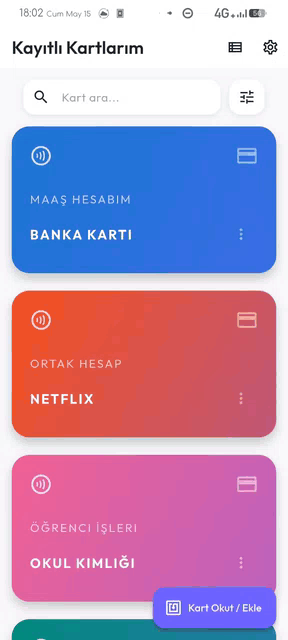
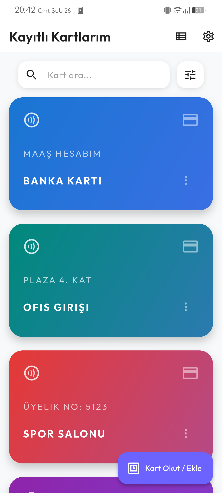
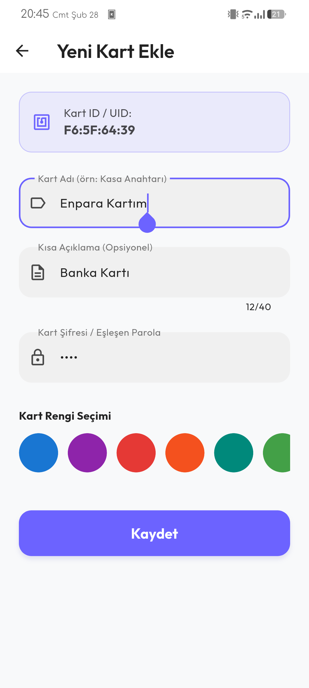
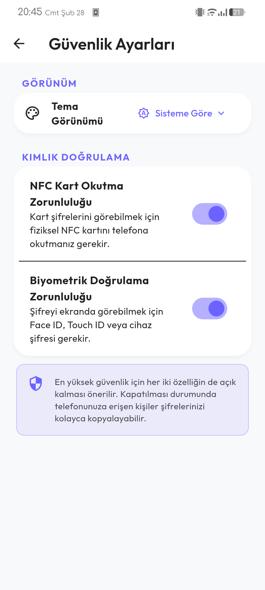
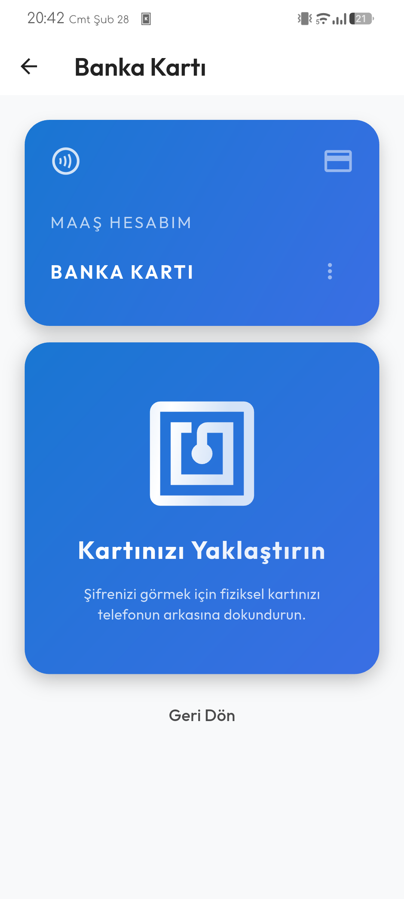
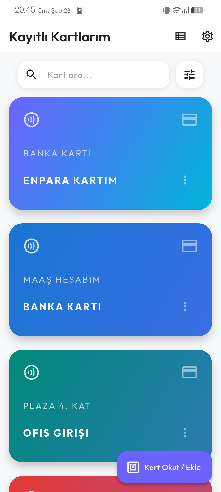
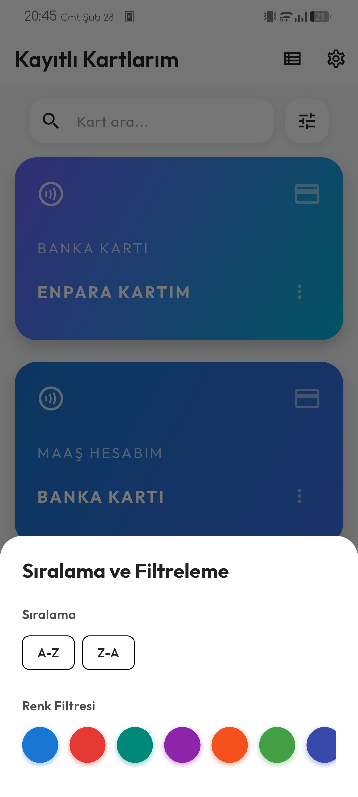
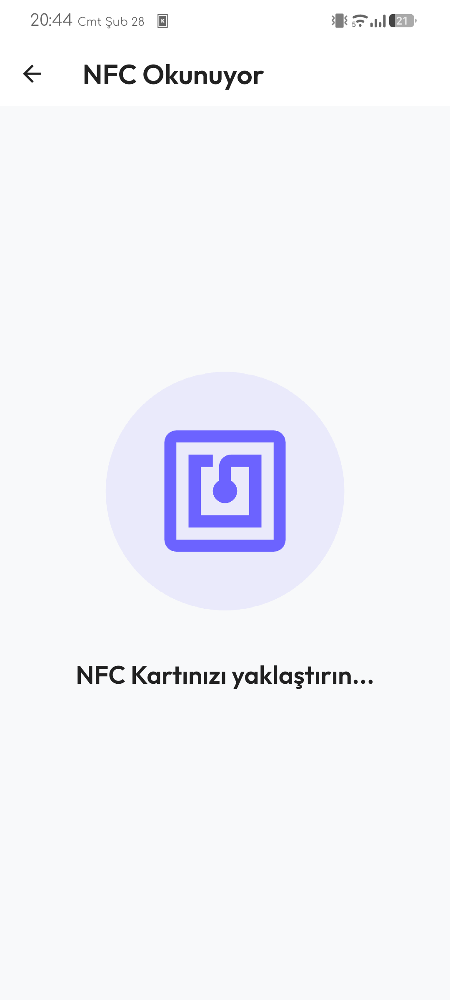
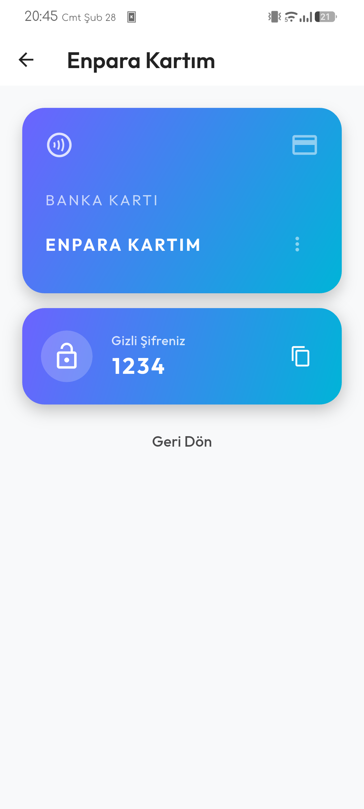
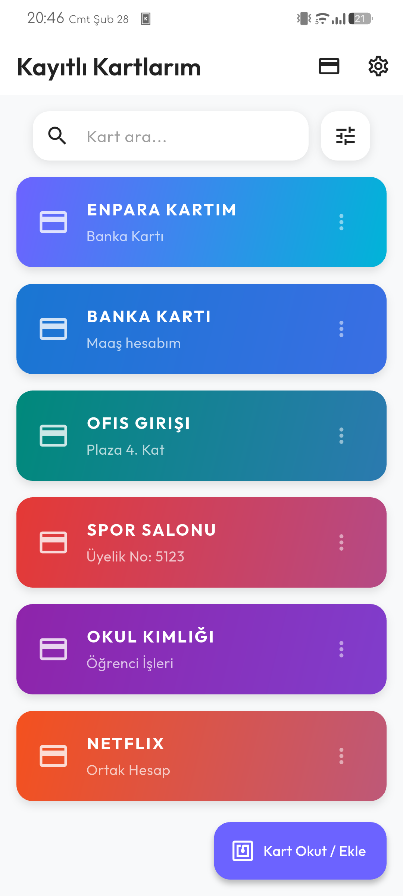

# NFC Kart Şifre Yöneticisi 🛡️💳

Aygıtınızda kredi/banka kartı bilgilerinizi ve şifrelerinizi güvenle saklamanız ve yönetmeniz için geliştirilmiş, modern, güvenli ve özellik dolu bir Flutter uygulaması. Cihaz içi güvenlik mekanizmalarını kullanarak maksimum gizlilik ve koruma sağlar.


## 📸 Ekran Görüntüleri

| Uygulama Demosu | Ana Ekran | Görüntüleme ve Güvenlik | Ayarlar |
| :---: | :---: | :---: | :---: |
|  |  |  |  |
|  |  |  |  |
|  |  | | |

## ✨ Özellikler

- **Güvenli Depolama**: Tüm kart bilgileri (Kart Sahibi, Kart Numarası, Son Kullanma Tarihi, CVV, Şifre) `flutter_secure_storage` kullanılarak şifrelenir ve yerel olarak cihazınızda saklanır.
- **Gelişmiş Kimlik Doğrulama**: Kaydettiğiniz kartları iki güvenlik katmanıyla koruyun:
  - **Biyometrik Doğrulama**: FaceID, TouchID veya cihaz parolasını destekler (`local_auth` ile).
  - **NFC Anahtar Doğrulaması**: Uygulamanın kilidini açmak veya verilere erişmek için harici bir NFC etiketini/kartını fiziksel güvenlik anahtarı olarak kullanın (`nfc_manager` ile).
- **Modern Arayüz (UI/UX)**:
  - Glassmorphism(Cam görünümü) efektleri ve akıcı animasyonlara sahip güzel, dinamik kullanıcı arayüzü.
  - Etkileşimli Shimmer (Parlama) yükleme efektleri.
  - Etkileşimli Pull-Down (Aşağı Çekilebilir) Menüler.
  - Özel font entegrasyonu (Outfit font ailesi).
- **Tema Desteği**: Açık Mod (Light Theme), Karanlık Mod (Dark Theme) ve Sistem Varsayılanı tema seçenekleri içerir.
- **Çevrimdışı Çalışma (Offline First)**: Tüm veriler tamamen cihazınızda depolanır. Hiçbir çevrimiçi sunucuya veri gönderilmez, tamamen çevrimdışı çalışarak verilerinizin üçüncü şahıslara geçmesi engellenir.

## 🛠️ Teknoloji Yığını ve Paketler

- **Framework**: [Flutter](https://flutter.dev/) (SDK ^3.11.0)
- **Durum Yönetimi (State Management)**: `provider`
- **Güvenlik**: 
  - `flutter_secure_storage` (Şifreli yerel depolama)
  - `local_auth` (Biyometrik doğrulama)
  - `nfc_manager` (NFC Etiket okuma/yazma)
- **Animasyon ve Arayüz**: 
  - `lottie` (Yüksek kaliteli karmaşık animasyonlar)
  - `shimmer` (Yükleme efektleri)
  - `pull_down_button` (iOS stili aşağı çekilebilir menüler)
- **Yerel Veri**: `shared_preferences` (Uygulama ayarları/tema tercihleri)

## 🚀 Başlarken

### Gereksinimler
- Bilgisayarınızda kurulu olan Flutter SDK (`^3.11.0`).
- Bir iOS veya Android cihaz/emülatör (NFC ve Biyometrik özellikleri verimli bir şekilde test etmek için fiziksel bir cihaz önerilir).

### Kurulum Adımları
1. Repoyu bilgisayarınıza klonlayın:
```bash
git clone https://github.com/yourusername/nfc_card_password_saver.git
```
2. Proje dizinine gidin:
```bash
cd nfc_card_password_saver
```
3. Gerekli paketleri (dependency) yükleyin:
```bash
flutter pub get
```
4. Uygulamayı çalıştırın:
```bash
flutter run
```

## 🔒 Güvenlik Yaklaşımı
Bu uygulama herhangi bir backend (arka uç) sunucusuna bağlı değildir. Bunun yerine, uygulama güvenliği cihazınızın yerleşik şifreleme donanımına (Secure Enclave / Keystore) devredilerek 'Sıfır Bilgi' prensibine dayalı tamamen çevrimdışı, güvenli bir depolama garantisi sunar.

## 🤝 Katkıda Bulunma
Katkılarınız, geri bildirimleriniz ve özellik talepleriniz için her zaman açığız! Katkıda bulunmak için 'Issues (Sorunlar)' sayfasını incelemekten çekinmeyin.

## 📄 Lisans
Bu proje MIT Lisansı altında lisanslanmıştır. Kullanım ve dağıtım hakları için lisans dosyasını inceleyebilirsiniz.
